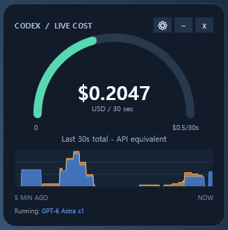

# Codex Usage Monitor

A local Codex Desktop/CLI usage dashboard with an always-on-top Windows widget.
Track tokens and estimated API costs by prompt, model, and subagent, with a live
cost gauge and history graph. Auto-review usage is excluded from user totals.



## Quick start

Requires **Windows and Node.js 24+**. Clone this repository, then run in PowerShell:

```powershell
.\scripts\Start-Monitor.ps1 -Open
```

This starts the service, widget, and dashboard at
[localhost:47831](http://127.0.0.1:47831). No `npm install` is needed.
Omit `-Open` to start without opening a browser.

```powershell
.\scripts\Ensure-Monitor.ps1 -NoWidget  # Service only
.\scripts\Stop-Monitor.ps1             # Stop the service
```

Close the widget with its **x** button. See [WIDGET.md](WIDGET.md) for widget
controls and optional Windows login startup.

## Data and estimates

- Reads `%USERPROFILE%\.codex\sessions` without modifying the source logs.
- Keeps its database and widget settings in `%USERPROFILE%\.codex-usage-monitor`.
- Runs on `127.0.0.1` only, with no telemetry or usage uploads.
- The local database contains prompt excerpts and project paths; keep it private.
- Costs use [the rate card](config/rate-card.json) and reflect recorded usage,
  not actual subscription charges or remaining quota. Updates can lag behind generation.

## Model price settings

Open **Model prices** from the dashboard or the widget's settings. Model IDs
are filled from recorded usage; enter USD per million tokens, or copy another
model's prices. Cache-write and long-context options are under Advanced pricing.
Blank prices are unknown, not zero. Totals with unknown costs are marked partial.

Custom prices live in `price-overrides.json` in the local state directory,
separately from the bundled rate card. Save applies immediately and recalculates
historical usage at the current configured rates. Use bundled prices to reset a
model, or Export/Import to share a catalog (prices only, no usage or prompts).
Imports preview their entry count and replace only matching model overrides.
The credit estimate remains 25 credits per USD.

## Development

Run `npm test`. After updating, restart the service and widget to load changes.

## License and credits

[MIT](LICENSE). This project grew out of earlier use of
[Codex Usage Tracker](https://github.com/douglasmonsky/codex-usage-tracker)
by Douglas Monsky. Its MIT notice and provenance details are preserved in
[THIRD_PARTY_NOTICES.md](THIRD_PARTY_NOTICES.md).

Unofficial community tool; not affiliated with OpenAI.
